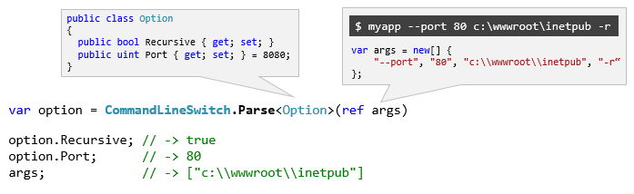

# CommandLineSwitchParser [](https://www.nuget.org/packages/CommandLineSwitchParser/) [](https://ci.appveyor.com/project/jsakamoto/commandlineswitchparser)

## Summary

This is a simple parser for command line options on .NET Framework & .NET Core.

What you should do is only define your option class and write code like "`var option = CommandLineSwicth.Parse<YourOptionClass>(ref args);`".

There is no need to annotate your option class with any attributes.



## Install

    PM> Install-Package CommandLineSwitchParser

## Example

This library provides `CommandLineSwitch.Parse<T>()` static method.

```csharp
// Open name space.
using CommandLineSwitchParser;
...

// Declare your own class that represents a command line switch.
public class Option1
{
    public bool Recursive { get; set; }

    public int Port { get; set; } = 8080;
}

// if args is "--port 80 c:\wwwroot\inetpub -r", then ...
public static void Main(string[] args)
{
  var options = CommandLineSwitch.Parse<Option1>(ref args);

  // Short switch matches an initial of option class property name.
  Console.WriteLine(options.Recursive); // True

  // Long switch matches a full name of option class property name.
  Console.WriteLine(options.Port);     // 80

  // Switches in "args" are stripped.
  Console.WriteLine(args[0])           // "c:\wwwroot\inetpub"
}
```

This library also provides `CommandLineSwitch.TryParse<T>()` static method, too.

```csharp
  if (CommandLineSwitch.TryParse<Option1>(ref args, out var options, out var err)){
    // Success!
  }
```

## Command line switches/options naming convention

- All properties of option class are mapped to lowercase option name.
- A full property name with converted to lower case is mapped to long name starts with a double hyphen ("--").
- An initial of property name with converted to lower case is mapped to short name starts with single hyphen ("-").

```csharp
public class Option1
{
    public bool Recursive { get; set; }
      // -> mapped to "-r" and "--recursive"

    public int Port { get; set; }
      // -> mapped to "-p" and "--port"
}
```

- If the option class has some properties those are same initials, those properties aren't  mapped to short name. Those properties are mapped only long name.

```csharp
// In this case, short name "-a" is unavailable.
public class Option2
{
    public bool AutoGenerate { get; set; }
      // -> mapped to only "--autogenerate"

    public int Align { get; set; }
      // -> mapped to only "--align"
}
```

- You can use "enum" type in properties of option class.
- "enum" values are also mapped to lower case symbols.

```csharp
public enum {
  Left,
  Center,
  Right
}

public class Option3
{
    public int Align { get; set; }
      // -> mapped to "-a" and "--align", 
      //    and this option can specify with 
      //    one of the "left", "center", "right".
}
```

## Parsing error handling

If `CommandLineSwitch.Parse<T>()` encountered invalid syntax command line arguments, it throws `InvalidCommandLineSwitchException` exception.

You can retrieve the details of parsing error from `ParserError` property of the `InvalidCommandLineSwitchException` exception object.

```csharp
// The option class has not "-x" switch/option.
public class Option1
{
    public bool Recursive { get; set; }

    public int Port { get; set; }
}

// if args is new []{"-x"} ...
try {
  var option = CommandLineSwitch.Parse<Option1>(ref args);
    // -> it throw exception!
}
catch (InvalidCommandLineSwitchException e){
  // You can access "e.ParserError" property
  // to retrieve details of the error.
}
```

`CommandLineSwitch.TryParse<T>()` return false when it encountered invalid command line arguments instead of throwing exception.

You can retrieve the details of parsing error from 3rd output argument of `CommandLineSwitch.TryParse<T>()` method.

```csharp
// if args is new []{"-x"} ...

if (CommandLineSwitch.TryParse<Option1>(ref args, out var option, out var err) == false){
  // -> it returns false.
  // You can access "err" output variable
  // to retrieve details of the error.
}
```

The parsing error information is provided by `CommandLineSwitchParserError` class.

`CommandLineSwitchParserError` class exposes the following properties:

Property type and name | Description
-----------------------|-------------
ErrorTypes ErrorType   | It represents the reason of parsing error.
string OptionName | The option name that causes parsing error.
string Parameter  | The option parameter that causes parsing error.
Type ExpectedParameterType | The .NET type that expected to option parameter.

`ErrorType` take the one of `ErrorTypes` enum values the following:

- UnknownOption
- MissingParameter
- InvalidParameterFormat
- ParameterOverflow

When the parsing error occurred:

- It returns only one of the first parsing error.
- The command line arguments are not stripped.

## FAQ

### Questions

- Is there any way to setup custom option name?
- Can I get "usage" document automatically generated?
- Can I use "/" instead of "-" ?
- Can I use "-name=value" syntax instead of "-name value" ?
- Can I use "-ab" syntax instead of "-a -b" ?

### Answer

Sorry, no way.

I'm interested in keeping this library to simple usage.  
That is the most important reason I created this library despite there are already numerous command line parsing libraries.

So I have no plan at this time.

If you need those features, you may consider using [Microsoft.Extensions.CommandLineUtils](https://www.nuget.org/packages/Microsoft.Extensions.CommandLineUtils/) ([see also](https://msdn.microsoft.com/magazine/mt763239.aspx)), or choose one of the many libraries published on NuGet that was tagged with "commandline" (search result is [here](https://www.nuget.org/packages?q=Tags%3A%22commandline%22)).

## License

[Mozilla Public License, version 2.0](LICENSE)
